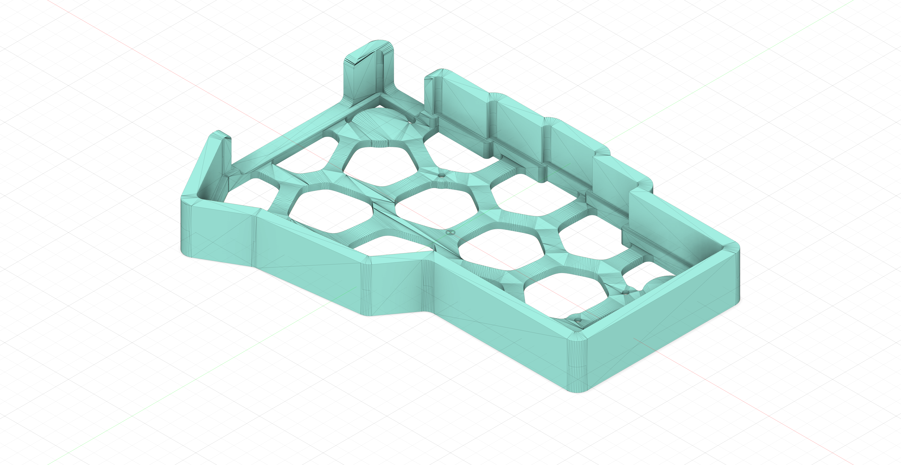
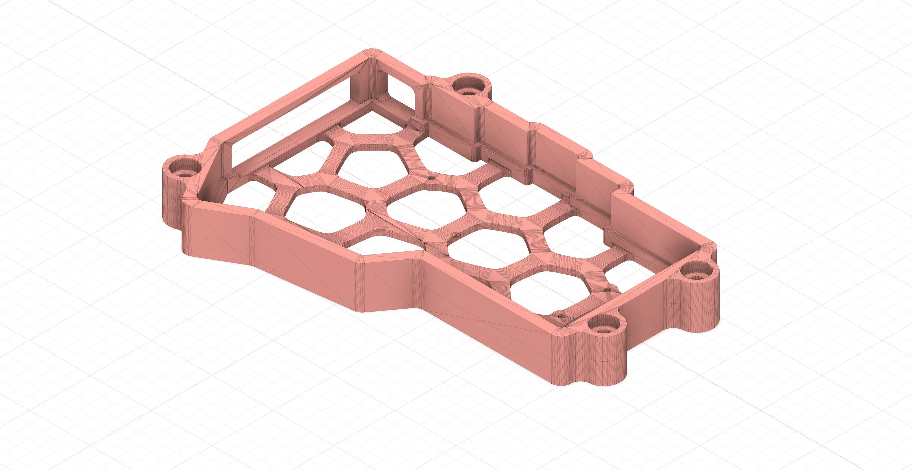

## Build firmware

- Setup [QMK](https://docs.qmk.fm/#/newbs_getting_started) on your machine and install required libraries when prompted.
    - Will be using QMK CLI since thats easiest for me, but feel free to use QMK toolbox if thats what you prefer.

- Copy config to `default` keymap dir in `QMK/keyboards/<keyboard-name>/keymaps/default`.
- Run `qmk compile -kb <keyboard-name> -km default -e CONVERT_TO=promicro_rp2040`. Here I have used a splinky (an RP2040 based MCU, Oxb2) so I had to convert and generate UF2 file, for you it might be different depending on what type of MCU you are using (KB2040, RP2040, ATMegam etc.)

## Case

These are my modified versions of already existing cases for corne. Project contains stl files for two types of cases, one a normal case and the other with tenting support. For tenting, 2 M4 Allen head screws of length 30-40 mm are required and 2 M4 12-18 mm length allen head screws are required per case.
Here are some images:

- Regular case

- Tenting case with holes for screws

